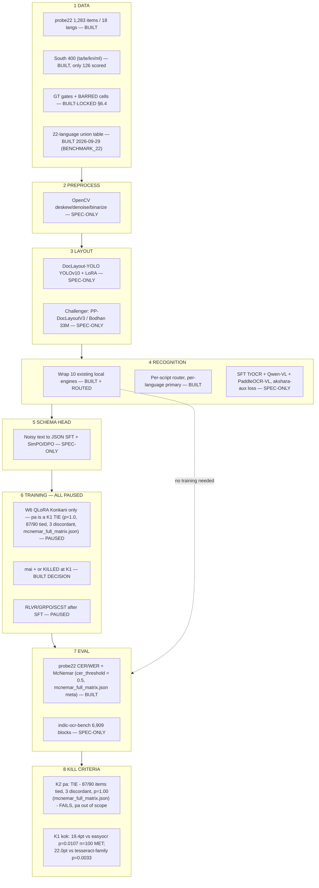

# AksharDrishti — Draft Research Plan for review

**2026-09-29 · prepared by the orchestrator · **Revised 2026-09-30 per `fix_specs/W1H_PLAN_FIXES.md` (13 monitor defects; D1/D2 already closed earlier)** · STATUS: DRAFT, for cross-questioning · Every number states its n; sources in the appendix.**
Evidence appendix: `VINAY_MEETING_PACKET.md` (corrected) · `docs/campaign/BENCHMARK_22.md` · `COMPETITOR_INTEL.md` · `EDGE_THESIS.md` · `MULTI_LLM_EVAL.md` · `MENTOR_PLAYBOOK.md`

---

## 1. The problem and the bar (≈120 words)

Beat **Sarvam Vision 2.1** on Indic OCR across **22 Indian languages**, honestly, by hybrid integration of models that already exist.

**Their 87.39 is not comparable to any CER of ours, and the plan does not pretend otherwise.** From the benchmark card (opened 2026-09-30, PRIMARY): **6,909 curated text-block samples** (their headline macro is over the 22 non-English languages, so 6,609 = 6,909 − 300 English samples; it is **not** a post-exclusion count — ambiguous-GT and degenerate outputs are excluded separately and move the valid count per run), **23 languages = the 22 Eighth-Schedule languages plus English**, samples curated at **semantic block** level, all ground truth **"reviewed twice by human language experts"**, scored with CER and WER after normalisation, `Word Accuracy = 100 × (1 − WER)`, and **runaway-repetition and ambiguous-ground-truth samples excluded** from valid-sample metrics.

- 87.39 is a **macro-average over the 22 non-English languages** (our arithmetic on their per-language table: 87.3909). **UNKNOWN, do not assert:** the card defines word accuracy as 100 × (1 − WER) but never states that 87.39 *is* that figure.
- Their bench is **block-level, ours is page-level**; it is 6,909 blocks, ours is 1,227 pages; the normalisation differs; degenerate outputs are dropped on their side and scored 1.0 on ours.
- **The two vendor benches disagree with each other**: Sarvam's and Bodhan's per-language winners differ on **8 of 22** languages (Kashmiri flips by 8.9 points). Neither is a third-party arbiter.

**Verdict: NO — no CER of ours is comparable to 87.39.** So we do not chase it. We publish a 22-language table on our own terms and let a third party compare. **And the hackathon does not publish a metric at all** (verified 2026-09-30 against the official page): no CER/WER/threshold/weighting appears anywhere — machine-checked zero hits for CER, WER, metric, S/D/I, seconds, latency, score, weight. Evaluation is **product-weighted**: innovation/novelty, business use case, technical feasibility, product roadmap, team ability, addressable market. **No official deadline exists either** (10 of 12 timeline rows are TBD). "22 languages" appears nowhere on the page — our 22-language scope is our own, not a published requirement. Source: `W4_reports/RQ1_official_rules.md`; harvest `docs/research/level7/c/c2/LEDGER.md` §A.

**Our rule: no claim without its n.** At n=3 per language, nothing is a win.

## Gate 1 — CONDITIONAL PASS (Bodhan base, MLX 4-bit + bf16 on disk)

| Run | n | 4-bit CER | bf16 CER | Notes |
|---|---|---|---|---|
| sample-100 (same 99) | 99 | 0.6878 | 0.6863 | delta 0.0015 — B-01 PASS |
| pair-only (300 gold) | 300 | 0.4034 | 0.4010 | beats surya 0.5660 |
| bench small_rep | 1173 | 0.0540 (WER 0.1356) | — | official metrics.py; 0.52 s/crop |
| official-path | 99 | — | — | vendor assert; parity waits GPU day |

SSOT: `DISPATCH_LOG.md` §36. Variants on disk at `level2/models_bodhan/`: official (1.8 GB), MLX 4-bit (633 MB), MLX bf16 (1.7 GB). All Apache-2.0.

## 2. How an OCR model is trained — the flowchart (≈150 words)

You asked for this first. Full version with every node's source line: `MENTOR_PLAYBOOK.md` §2.

**The honest reading: everything that runs, runs. Everything that trains is paused.** Four stages of the PPT pipeline are SPEC-ONLY; the only BUILT path is the wrap-and-route one, and that is the path this plan is about.

## 3. Where we stand today — the 22-language benchmark (≈250 words)

Full table with per-engine mean/median, abstention and the Sarvam column: **`BENCHMARK_22.md`**. Regenerate: `python3 level2/unified/build_benchmark_22.py`.

**"22 languages" holds for labelled data only.** Labelled = 1,283 (probe22) + 400 (South) = **1,683**. Scored is far smaller: probe22 **1,227** (10 local engines, 11 model strings — the three Tesseract aliases share a family and mean CER, but they are **not** byte-identical: their predictions differ on **857 of 1,227** items, i.e. different language packs — 12,324 rows) and South **126 of 400**. So **no** language is labelled-only — the smallest scored n of all 22 is 19 (Assamese) — but the four South languages are the thinnest, and **Malayalam (n=5) is below your 5–10 floor**.

| | value |
|---|---|
| Languages | **22** = probe22 18 + South 4 (ta, te, kn, ml) |
| Labelled | probe22 **1,283**; South **400** → **1,683** |
| Scored | probe22 **1,227**; South **126 of 400** |
| n ≥ 50 | **13 of 22** |
| Below your 5–10 floor | **1** — Malayalam, n=5 |
 | No winner claim (n<50) | **9** of 22 (22 − 13 at n≥50) — as 19, mni 20, sat 20, gu 24, te 26, kn 25, doi 27, ne 37, **ta 70** is n≥50; the four South languages are ta 70 ✓, kn 25, te 26, ml 5 |

**What "significant" means here:** McNemar exact on per-item pass/fail, where an item counts as a pass when **CER < 0.5** (`mcnemar_full_matrix.json` `meta.cer_threshold = 0.5`), two-sided. With ~90 ties per language the test has little power — that is why Konkani (31 discordant) is meaningful and Punjabi (3 discordant) is not.

**Best local engine at n≥50** (12 languages qualify): surya 9, tesseract-family 2, easyocr 1. Per-language winner CER sits in the 0.10–0.40 band in **7 of those 12**. Ranked worst-first the winners are **ur 0.623, ks 0.589, bn 0.476, kok 0.425**, then sd 0.316, or 0.259, hi 0.220, mr 0.205, sa 0.175, brx 0.165, pa 0.145, mai 0.030. Konkani is **fourth-worst, not the worst** — and it is the one where Sarvam is strongest *(footnote: Sarvam Konkani 97.41 is THEIR word-accuracy on their bench, not our CER — mixes metrics; our rank of that cell among their 22 is UNKNOWN — their table and Bodhan's disagree, a FLIP)*. The largest **gap to the runner-up** is **Hindi, 0.220 vs 0.504 — a 28.4-point lead**; Konkani's is 19.4 points (surya 0.4248 vs easyocr 0.6186).

### The Sarvam comparison, stratified by ground-truth tier — this is the number that matters

A pooled "we lead on 10/18 languages" is **not a result**, and it is not shown here. Split by how the ground truth was made (`sheet.csv` × `manifest.json` `gt_source`, the 54 Sarvam-paired items):

| Ground-truth tier | n | Sarvam mean CER | surya | best local per item |
|---|---:|---:|---:|---:|
| `official_pair_txt` — human gold (bn/hi/sa) | 9 | **0.064** | 0.535 | 0.243 *(oracle)* |
| `official_pdf_layer` — PDF text layer | 36 | 0.311 | 0.229 | **0.229** *(oracle)* |
| `sarvam_bench` — human-reviewed twice (per their card) | 9 | **0.278** | 0.730 | 0.617 *(oracle)* |

> **The one-liner for you: on the 18 human-verified items where Sarvam ran, Sarvam's CER is 2.5× lower than the best of our 10 local engines (0.171 vs 0.430). Our engines lead only on PDF-text-layer ground truth (n=36), which may favour layout-literal output. n is 3 per language.**
>
> **Three caveats, and you should hear all three.** (i) "Best of our 10 local engines" is a **per-item oracle** — a different engine for each item — not one engine. Using **surya always** the gap is **3.70×** (0.171 vs 0.632). (ii) The 18 human-verified items cover only 6 languages — **bn, hi, sa, as, mni, sat** — and **two of them are the dead-script cells** where no local engine can compete at all. Excluding mni and sat, the gap is **2.02×** (0.132 vs 0.265). So roughly a third of the 2.5× is a **coverage gap, not an accuracy gap**. (iii) n is 3 per language throughout.

Column 4 is a **per-item oracle** (best of 10 engines chosen per item), not a single engine — with surya always it is 0.632 and Sarvam is 3.70× better.

Every one of our **21 item-level wins** over Sarvam sits in the PDF-layer tier (**22** under the per-item-oracle reading), and **none** in either human-verified tier. **Hypothesis, not conclusion:** PDF text layers encode reading order, hyphenation and header/footer artefacts that align with Tesseract-style output and penalise a VLM that reads the page naturally. If that is right, our "lead" is a measurement artefact. **If it is wrong, we have a genuine problem on human-checked text.** Either way the pooled 10/18 must not be presented as a win, and n=3 per language is directional at best.

**Two findings that matter more than the table:**

1. **Our evidence sheet cannot regenerate our own numbers.** The stored `CER` column in `sheet.csv` reproduces from its own `gt`/`prediction` via the repo's `metrics.py` on **111 of 400** sampled rows within 1e-4, of which **66 exact** — re-measured 2026-09-30; no normaliser variant closes the gap. Every number in this section is computed *from* that column, so they are internally consistent — but a reviewer who re-runs the scorer gets different numbers, and there is no generator script for the file on disk. **Per the standing meeting-day rule, every `sheet.csv` number here is "CER as stored by the probe scoring pass; independent re-derivation is in progress."** Fixing it means regenerating a LOCKED file (U5/U9).
2. **South is thinner than it looks, and the two partitions disagree.** 126 of 400 pages carry a CER (219 nulled `gt_thin` at GT<200 chars, 55 nulled legacy mojibake). On the **dominant-script** partition Kannada and Malayalam have ~4 scored pages each; on the **lang-tag** partition kn=25 and ml=5. Both are reported in `BENCHMARK_22.md`; the honest statement is that Malayalam is the only language below your floor, and that kn/ml rest on ~25 scored pages, not 100.

**What we do not measure, and the honest reason we do not know the rubric.** A metric set of **CER with bootstrap 95% CI, WER, a substitution/deletion/insertion breakdown, and seconds per page** circulates in a **student B.Tech project repo, not in any official hackathon document** — `proto-80` withdrew that quote on 2026-09-30 and records **official rules: UNKNOWN (U2)**. So we are **not** claiming these are the judging criteria. What survives: confidence intervals, an error-type breakdown and speed are what any serious reviewer asks for, and speed matters for a **5,344-image** test set. **Our table reports none of the three today.**

**The coverage gap behind it.** All **1,283** probe items are `printed`, with **0 tables, 0 mixed-script**, and `quality` **unknown for 983 of 1,283**. The hackathon targets handwritten and low-quality documents. **We have measured none of that** — see question 11 (U13).

**Weakest cells:** Santali and Meetei Mayek (no local engine emits either script — §6), Nastaliq cursive (ur, ks), and degraded scans (untested, per the line above).

## 4. What changed in the field in the last 6 weeks (≈250 words)

Six items, each with a source opened on 2026-09-29. Full detail in `COMPETITOR_INTEL.md`.

1. **Sarvam Vision 2.1 self-evaluated.** Macro-average over the 22 non-English languages of 6,909 block-level samples, degenerate outputs dropped, on a benchmark Sarvam built and whose GT their card says was human-reviewed twice. **The two vendor benches disagree with each other on 8 of 22 per-language winners — Kashmiri flips by 8.9 points** — so neither is a third-party arbiter and neither settles anything. *Status: usable now — it is the reason §1 says NO.*
2. **Sarvam moved to block-level, not page-level, curation.** Our own sheet has `mixed_script=False` on all 12,324 rows, so a per-script-block metric buys us one cell and nothing else. *Usable now; kills a proposed edge.*
3. **consensus-entropy OCR verification (CVPR 2026).** Training-free inter-model agreement for best-output selection and thresholded routing. This is what our proposed router was, published. *Kills our version of that edge; read before building any router.*
4. **LV-ROVER-MLT (DocEng 2026 winner)** — gated multi-stream fusion, but 5 streams of *one* recogniser on 57 Maltese pages. Its diacritic-restoration gate is the one transferable idea. *Watch; the Indic analogue measured worse than doing nothing.*
5. **GlotOCR Bench (LMU/TU Munich)** — makes cross-script hallucination a headline metric and reports a **font-coverage effect**: low-resource tiers carry a median of **1 font per family** *(figure from the search excerpt, not re-read from the paper full text this run — UNVERIFIED)*, and the paper attributes low-tier failure to *pretraining coverage* of those scripts, **not** to font availability. Our machine has **1 Ol Chiki and 10 Meetei Mayek fonts (fc-list; macOS Supplemental)**, so the font count is *our* constraint, not their conclusion — the analogy is suggestive, not evidential. *Usable now, and this is the weakest link in §6.*
6. **An Indic Tesseract traineddata pack including Ol Chiki and Meetei Mayek** exists (`github.com/indic-ocr/indic-ocr.github.io`), ~2–4 MB, no training. *Project README states the pack includes Ol Chiki + Meetei Mayek traineddata; licence still UNVERIFIED (boss decision). Needs your download approval.*

7. **OCR-specialised base + LoRA beats generic VLM (Consensus Q1)** — in Indic print, same-language pretraining gave 92% WRR vs cross-lingual 51% vs scratch 6% (Faraz 2026 Chitrapathak-2; Manna 2025). Decision unchanged: Bodhan base + LoRA per language.
8. **4-bit LoRA "often preserves gains" but with caveats** — QARI arXiv 2506.02295 used optional 4-bit; Elkousy 2026 4-bit Qwen2.5-VL −29% CER on Arabic print. Few controlled 4-bit vs 8-bit OCR ablations exist. CONTRADICTION-CHECK against proto-100 B-01 (no 4-bit for ks/ur/sd); B-01 stays until Day 1's measured 4-bit vs bf16 per script decides it.
9. **Synthetic + real transfers better than synthetic alone** — Baseer 300k synthetic + 200k real; Singh 2026 shows real scans collapse 9/10 systems (EasyOCR chrF++ 93.6 → 58.3). Day 2 data must include real scans.
10. **Layout + reading order strong** (Consensus Q3) — IndicDLP arXiv 2512.20236, dots.ocr arXiv 2512.02498. Justifies Bodhan's layout + reading-order stage.
11. **LM post-OCR correction strong** — Bhandari 2026: hi 10.20→6.73, gu 6.10→1.39, mr 8.19→3.29 CER; Sanskrit +23 points (Maheshwari 2022). NEW build candidate B-18: post-correction on Bodhan's own errors (leak-free).
12. **Handwriting: PARSeq-style transfer strongest across 10 Indic languages** (Consensus Q2) — Lalitha 2025; ICDAR 2023 Indic HTR winner 95.94% CRR / 88.31% WRR (Mondal 2023). Handwriting is now central (proto-104 rev 3 §H).
13. **Best CERs for hard cases** — Urdu printed Nastaliq 0.91% (Nasir 2024); Urdu handwritten 5.27% (Hamza 2024); Hindi handwritten 2.14% (Kumar 2026); degraded Sanskrit print 3.71% (Dwivedi 2020). **Kashmiri Nastaliq: no CER paper** — our own measurement is the reference (B-03).

**Deliberately not a priority: Unicode normalisation.** NFC vs NFKC differs in form on 564 of 12,324 strings but produces **0 exact-match flips**. Do not spend five days there.

## 5. Proposed hybrid integration vs your PPT (≈350 words)

Your PPT (4 stages): OpenCV → DocLayout-YOLO → parallel SFT of TrOCR + Qwen-VL + PaddleOCR-VL with an akshara-boundary auxiliary loss → SCST/RL on CER → IndicBERT-style JSON head + DPO. **That architecture is not contradicted by anything we found. It is also unbuilt, and stage 2's training is paused.**

| | **Option A — wrap-only, $0, no downloads** | **Option D — wrap + script-router + restoration + Sarvam subsidy** |
|---|---|---|
| Ships | the per-script routing table that is **already on disk**; nothing new built | the same wrap **plus** an explicit learned script-router, R4 restoration pre-pass, and an API subsidy for sat/mni |
| Does **not** include | **any QLoRA** — A is the no-training, no-download baseline | the QLoRA fine-tune is a *separate* add-on (the packet's "Option A" and this doc's "A" have drifted apart; the the level7 `W5_STRATEGY_OPTIONS.md` A **does** include QLoRA kok+pa (that copy now lives only in `_archive/`)) |
| Cost | **$0** | $0–30 (the $12 API figure is **unsourced**) |
| Evidence | 7 of 12 languages at n≥50 in the 0.10–0.40 band; both dead languages cost one 2–4 MB file each | the restoration pre-pass is borrowed from work measured only on English/French/Spanish historical pages — **no non-Latin measurement** |
| Risk | no accuracy gain at all; a presentation win | spends a day on a router whose **measured routing gain was −0.0351 CER (negative)**, and money on an unpriced API |

**Punjabi does not pass K1.** `mcnemar_full_matrix.json`: surya vs tesseract_indic on `pa` = 90 common items, **87 ties, 3 discordant, p = 1.00 → tie**. Konkani is the only language that passes (31 discordant, p = 0.0033). **So any QLoRA scope is Konkani only, not Konkani + Punjabi** — and `KILL_CRITERIA.md:56` and feed §12.2 both still say the opposite (errata filed, files not edited).

**Our recommendation — and it is a recommendation, not a decision: Option A as redefined in the first column (wrap-only, $0, no downloads).** Not because D is wrong, but because the thing D adds over it is a script-router, and we measured the router **losing** (−0.0351 CER). Note the naming hazard: the packet's "Option A" (wrap-only **+ QLoRA on kok+pa**) and `docs/research/level7/W5_STRATEGY_OPTIONS.md`'s A (wrap + QLoRA kok+pa, $0, 3–4 h) are **not** the same as this column — three documents currently use the letter A for two different options. That has to be fixed before Vinay picks one. The 2-hour change with the better expected value is smaller than either option: **report median CER and abstention rate instead of mean**, because 43.7% (paddleocr_indic) to 50.3% (anuvaad_tesseract) of some engines' predictions are empty and an empty prediction scores CER 1.0.

**One commercial fact before you choose an engine (question 12).** Our best engine is **surya 0.22.1**, and its package contradicts itself: the dist-info METADATA says **Apache-2.0**, while the LICENSE text is a **modified AI Pubs OpenRAIL-M** — *"free for research, personal use, and startups under $5M funding/revenue"* (`docs/legal/LICENSE_AUDIT.md:21`). That is a business decision, not an engineering one, and it is the only licence question in the stack that is not clean.

**Backbone (U4, unresolved conflict).** The feed locks **Qwen2.5-VL-3B @4-bit** as PRIMARY (`W6_QLORA_SPEC.md:53`); GLM-OCR 0.9B is ALTERNATE 2. **No candidate weights are on disk.** On GLM-OCR's OmniDocBench v1.6 presence our two reviewers **disagree** (one says the table omits it, one found it at 94.71, rank 3) — tagged **CONTRADICTION / UNKNOWN** pending a source check. Either way the GLM-OCR recommendation is not evidence-backed yet. Recommend Qwen2.5-VL-3B on the strength of the lock, with the note that it costs a download.

## 5.1 Plan v3 additions — Gate 1 numbers, Day-2 leak-free data, RF-21..37 pointers

### Gate 1 — CONDITIONAL PASS (Bodhan base, MLX 4-bit + bf16 on disk)

| Run | n | 4-bit CER | bf16 CER | Notes |
|---|---|---|---|---|
| sample-100 (same 99) | 99 | 0.6878 | 0.6863 | delta 0.0015 — B-01 PASS |
| pair-only (300 gold) | 300 | 0.4034 | 0.4010 | beats surya 0.5660 |
| bench small_rep | 1173 | 0.0540 (WER 0.1356) | — | official metrics.py; 0.52 s/crop |
| official-path | 99 | — | — | vendor assert; parity waits GPU day |

SSOT:  §36. Variants on disk at : official (1.8 GB), MLX 4-bit (633 MB), MLX bf16 (1.7 GB). All Apache-2.0.

### Day-2 leak-free data

**Rule:** a writer/page must never appear in both train and eval. Split-by-source-document (proto-89 §R-65). Hold out 10% of documents per language as eval. Sarvam's bn/hi/sa + Korean (the 300 gold pairs) serve as the external test set the training never saw.

### RF-21..37 pointers (from Consensus processing)

- **RF-21** C1-1: OCR-specialised base + LoRA beats generic VLM — supports Bodhan choice.
- **RF-22** C1-2: 4-bit LoRA caveats — CONTRADICTION-CHECK on B-01; measure first.
- **RF-23** C1-3: synthetic + real transfers better — Day-2 data must include real scans.
- **RF-24** C1-4: 100–1,000 labelled lines help cross-script transfer — Day-3 picks target languages with ≥ a few hundred real lines/words.
- **RF-25** C1-5: RLVR/GRPO — moderate; keep RL last and optional.
- **RF-26** C1-6: hard-example mining — weak; do not build.
- **RF-27** C1-7: cleaning labels improves CER by up to 1.8 pts — run proto-65 GT-defect checks before Day 3.
- **RF-28** C1-8: competitors to add — Chitrapathak-2, LightOnOCR-2-1B, HunyuanOCR-1.5, GlotOCR Bench, Qwen3-VL-8B.
- **RF-29** C1-9: Kashmiri synthetic — licence check for B-03; 600K-KS stays HOLD.
- **RF-30** C2-1..3: best CERs + Hindi/Urdu handwritten + no literature baseline for sat/mni/or.
- **RF-31** C2-4..5: tables/forms + restoration — B-06 gated pre-pass.
- **RF-32** C3-1: layout + reading order strong — justifies Bodhan layout stage.
- **RF-33** C3-2: LM post-OCR correction strong — NEW build candidate B-18.
- **RF-34** C3-3: multi-engine fusion — agreement flag only.
- **RF-35** C3-4: same-script language ID — IndicLID on recognised text.
- **RF-36** C3-5: structured output — our schema (B-11) is fine.
- **RF-37** C3-6/7: fair evaluation + Tamil refs.

## 6. Our edge (≈250 words)

**Four edge theses were drafted. All four were killed by three adversarial reviewers each (12 critiques). Zero survived.** Detail in `EDGE_THESIS.md`. Briefly: an akshara-validity fusion verifier **measured 61% worse than always using surya** (0.6766 vs 0.4190); a script-mismatch router had **95–100% precision and 0–5% recall** and **zero gain on exactly the cursive scripts we are worst at**; a per-script-block metric is something Sarvam's benchmark already does; and a ground-truth purity gate turned out to be a **bug, not an honesty fix**.

So: **we do not currently have an accuracy edge, and I am not going to claim one.** What the refutation did find is a coverage fact that three reviewers confirmed independently and that is cheap to fix:

> **0 of 200 local-engine predictions on Santali contain a single Ol Chiki character.** No local engine reads Ol Chiki or Meetei Mayek at all. The constraint is fonts — `level2/probe22/tessdata/` lacks only `mni` and `sat`; `/opt/homebrew/share/tessdata/` has `kan`, `mal`, `tam`, `tel` and `level2/research/smoke/anuvaad_tesseract/tessdata/` has anuvaad variants.

That is a **coverage** edge, not an accuracy edge: it is the one place on our board where we can state as a measured fact that an engine does not read a script — which no Indic OCR benchmark can currently say, because they all score whole pages. **The fix is a Tesseract traineddata download for `mni` and `sat` only — the only genuinely missing traineddata — awaiting your approval (U7, question 5).** That is the single ask this plan makes, and it is the only edge-shaped thing we found.

**The second honest finding:** the fusion ceiling is real — on a seeded 300-item sample the per-item oracle over our 10 engines scores **0.3213** against **0.4190** for always using surya, a 0.098 gap — but **67% of it is the `sa` cell, where surya emits 100% empty predictions** (a bug, not a fusion problem). Ex-`sa` the gap is 0.0332. *(The hunt's original 0.4277/0.5229 pair did not reproduce and is withdrawn.)* Fixing the abstention bug is one day with a measured payoff; it is the only real engineering item this week produced.

## 7. What the evaluation said (≈200 words)

**PARTIAL, and honestly so.** Of the three evaluators you asked for — OpenCode, Claude, ChatGPT — **one could not run (no OpenCode MCP session — the leg needs a session with the opencode MCP, or the boss pastes the prompt into OpenCode), one could not run (budget), and one is waiting on your paste.** Full disposition in `MULTI_LLM_EVAL.md`; the self-contained prompt is `CHATGPT_EVAL_PROMPT.md` — paste it and send the answer back, it takes two minutes and it is the cheapest thing you can do to unblock A3.

What the 12 critiques we did run changed: the plan now opens its 5 days with the 2-hour median/abstention change instead of a router; it says "zero edge theses survived" in those words; it de-scopes the fusion win to 0.0332; it halves two inflated dev-day estimates; and it names normalisation as a place **not** to spend time. Seven of eleven critiques were accepted **with a verification each** — and two critiques raised by all three reviewers were **rejected**, because the measurement said so. That is your rule working: accepted by the process, not by the AI.

## 8. Questions for cross-questioning (≈150 words)

0. **Still open and needing you: U1 dates, U2 deadline, U4 options+backbone, U5 re-scoring.** **Decided already** (so I am not re-asking): U7 download = YES after licence check · U6 mni/sat = human re-verify · U10 level2 restructure = YES after the meeting · U11 South re-run = YES, feasibility first.
1. **Dates (U1).** "After next Wednesday" — do you mean this Wednesday (2026-09-30) or 2026-10-07? 43 files carry a wrong weekday; I will not guess.
2. **Deadline (U2).** Oct 4, Oct 15, or qualifiers closing 30/09? Three sources disagree and one says "Oct 4 (Sat)" — Oct 4 is a Sunday.
3. **Option A or D (U4), and which backbone** — Qwen2.5-VL-3B or GLM-OCR 0.9B? No candidate weights are on disk.
4. **Backbone weights** — do we download, or stay wrap-only at $0?
5. **DECIDED — download the Tesseract models for Ol Chiki and Meetei Mayek (U7), after a licence check.** Scope corrected by the lead: **only `mni` and `sat` are genuinely missing.** `kan`/`mal`/`tam`/`tel` exist at `/opt/homebrew/share/tessdata/` and in the anuvaad engine's own `tessdata/`. Fonts are not the blocker either — macOS ships **10 Meetei Mayek** faces; Ol Chiki is the scarce one at **1**. The indic-ocr project states its pack includes both scripts; **licence unverified**. Ask closed. ~40–70 MB, no training. This is the only item that unlocks two dead languages, and the one measured edge we have. **Corrected and smaller than first stated: only `mni` and `sat` are genuinely missing — `level2/probe22/tessdata/` lacks `mni`/`sat`, but `/opt/homebrew/share/tessdata/` has `kan`, `mal`, `tam`, `tel` and `level2/research/smoke/anuvaad_tesseract/tessdata/` has anuvaad variants. The project README states the pack includes Ol Chiki + Meetei Mayek traineddata; licence still UNVERIFIED (boss decision).** Those four South languages have almost no scored pages.
6. **DECIDED — re-verify mni and sat §6.4 with a human, not an LLM (U6).** Their ground truth comes from `sarvam_bench`, whose card says it was **"reviewed twice by human language experts"** — not machine GT, as our protocol assumed. So the mni/sat BARRED verdicts may be a **verifier-competence artefact** (a vision verifier that cannot read Ol Chiki or Meetei Mayek), not bad data. §6.4 stays LOCKED until you say otherwise. **This one could change two languages' status.**
7. **OPEN (U8) — the `src/` + `tests/` build.** ~1,995 lines of untracked QLoRA/GRPO, written 19:51–20:07 yesterday, and it kept being built and **imported** after 21:00 (`tests/test_basic.py`, `__pycache__` written 21:21). It predates your review. Stop it, archive it, or authorise it?
8. **May I tell you our evidence sheet cannot regenerate its own CER column?** 111 of 400 sampled rows reproduce within 1e-4 (66 exactly), and there is no generator script for the file on disk. Regenerating it is blocked because `sheet.csv` is LOCKED.
9. **Re-scoring (U5) and adopting the rebuilt sheet (U9).** Score the 56 unscored manifest items and regenerate `sheet.csv`; if the forensic rebuild says the stored CER is wrong, do we adopt `sheet_v2.csv` for all reporting? **I recommend yes to both, after this meeting.**
10. **Are you willing to present the tier-stratified result (§3) rather than the pooled one?** On human-verified ground truth we are 2.5× behind Sarvam; on PDF-text-layer ground truth we lead. That is a weaker headline and a more defensible one.

## 9. Next 5 days if approved (≈120 words)

| Day | Do | Kill criterion |
|---|---|---|
| 1 | Median + abstention-rate columns; fix the surya `sa` all-empty bug | if the abstention fix does not move `sa` below 0.30, stop and re-derive |
| 2 | Install + score the Ol Chiki / Meetei Mayek traineddata (needs approval) | if either file is absent from the pack, abandon and report |
| 3 | Re-score the 2 dead languages; publish the 22-language table v2 | if Ol Chiki CER > 0.90 across all engines, the cell is not fixable this week |
| 4 | Regenerate `sheet.csv` from the 56 additions (U5) | if the CER column still does not re-derive, escalate before any external claim |
| 5 | **Submission path**: script ID → route → engine → output for the unlabelled test images. IndicPhotoOCR already ships a CLIP script identifier on disk (`.deps/IndicPhotoOCR/IndicPhotoOCR/script_identification/CLIP_identifier.py`, weights licence TODO). The submission set is `Datasets/akshardrishti_official/test/` = **5,344 images** (measured 2026-09-30; the whole official set is 20,656 images, the test subset is the 5,344). | if script ID is unavailable for >10% of the set, the routing table cannot be built and we submit a single-engine baseline |
| 6 | Write-up + demo | — |

11. **(U13) Do we add handwriting / degraded / low-quality coverage?** All 1,283 items are printed with 0 tables and 983 of unknown quality, while the hackathon targets handwritten and low-quality documents. Without this, we are being scored on a distribution we have never measured.
12. **(U14) Is the surya licence acceptable commercially?** Modified OpenRAIL-M caps use at $5M funding/revenue, and the package's own metadata says Apache-2.0. If that cap is a problem, the best engine in the table may not be shippable.

Everything above assumes **no training** and **$0**. Any day that needs a download is blocked until you approve it.

---

## Appendix — sources

**Files:** `docs/campaign/BENCHMARK_22.md` · `docs/campaign/COMPETITOR_INTEL.md` · `docs/campaign/EDGE_THESIS.md` · `docs/campaign/MULTI_LLM_EVAL.md` · `docs/campaign/MENTOR_PLAYBOOK.md` · `docs/campaign/CHATGPT_EVAL_PROMPT.md` · `level2/probe22/fix_specs/W1A_PACKET_AUDIT.md` (54 specs, 19 BLOCKER) · `docs/campaign/checkpoints/W1_reports/{1E_hunt,1E_lensA,1E_lensB,1E_lensC,1G_verify,1F_onepager}.md` · `level2/probe22/sheet.csv` · `level2/probe22/manifest.json` · `level2/probe22/metrics.py` · `docs/architecture/PPT_SPEC.md` · `docs/architecture/W5_STRATEGY_OPTIONS.md` · `docs/research/level7/W6_QLORA_SPEC.md` · `docs/research/level7/KILL_CRITERIA.md`
**URLs opened 2026-09-29:** `huggingface.co/datasets/sarvamai/indic-ocr-bench` (card, tree, `metrics.py`, `README.md`) · `sarvam.ai/blogs/sarvam-vision-2-1` · `arxiv.org/pdf/2607.00250` · `arxiv.org/pdf/2604.12978v1` · `arxiv.org/pdf/2606.29213` · `github.com/indic-ocr/indic-ocr.github.io`
**Evidence tags used throughout:** PRIMARY / MEASURED / DERIVED / CONTRADICTION / UNKNOWN / REJECTED / DEAD.
