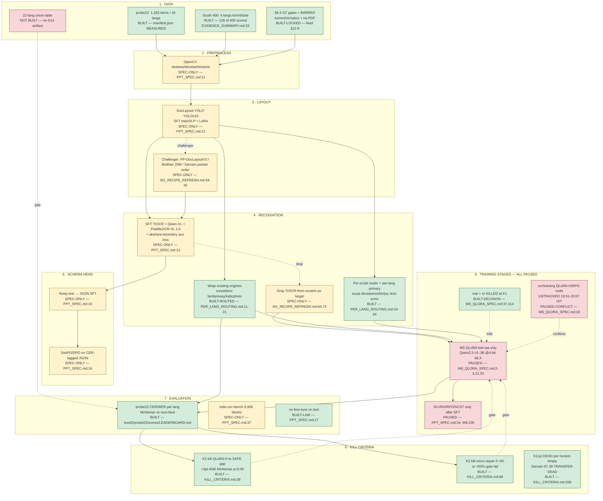

# MENTOR PLAYBOOK — the lead's method, and the repo measured against it

**Miss (Step 1C) · 2026-09-29 ·** protocol `proto-13-w1c-mentor-playbook.md`
**PRIMARY:** raw transcript `_reports/research/MEETING_2026-09-29_STRUCTURED.md:7`. All quotes `grep -F`-verified verbatim; nothing inside quotation marks is paraphrased. Its D1–D7 / A1–A7 table is **DERIVED**, not evidence. §1 uses short quote forms, §4 full.
**Second source (partially read at write time; full read 2026-09-29 verify-time: 27,370 chars tags-stripped — negative findings confirmed: 0 flowchart / 0 consensus / 0 multi-LLM hits in the full text):** `sync - ocr - September 10.docx`, 27,672 chars with paragraph newlines. All three are new on 2026-09-29.

---

## 1. HIS METHOD, AS ORDERED STEPS

**a) Read how others did it first** — *"how other people have approached this problem"* · **YES** · `_archive/cleanup_2026-09-30/dedup_topic_superseded/DEEP_LIVE_RESEARCH.md:20-27`; `W1_RECIPE_REFRESH.md:52-58`

**b) Consensus.app, two or three searches** — *"Okay. So ten searches free daily. So in two, three searches, you'll get all the gist of people."* · *"Consensus dot app"* · **NO** · 41 non-archive `.md` hits (grep -ril consensus; was 38 at write time), mostly the *word* "consensus" in Santa-method voting; the 4 real ones (`W1_RECIPE_REFRESH.md:5`, `SOURCES.md:18`, `_archive/cleanup_2026-09-30/dedup_topic_superseded/DEEP_LIVE_RESEARCH.md:25`, `LIVE_LATEST_2026-09-29.md:99`) all say JS-gated or describe the tool without running it. **Zero Consensus.app results on disk.**

**c) "How to train an OCR" as a flowchart** — *"So maybe I will learn about it, flowchart, like what's the process, how to start, what to do then"* · **PARTIAL** · ASCII only, `W1_RECIPE_REFRESH.md:12-25`, `:27-46`. `grep -ril flowchart docs/` = 6 files (including this playbook), rest internal; `grep -rl '```mermaid'` outside `_archive` = **2 (protocol + this playbook's §2)**.

**d) Scan lab and company advances** — *"Then what I will do, I'll just check what are the recent advancements for, like, the OCR thing, like, is there any new breakthroughs there? Any research group or any company find something really interesting?"* · *"And if some labs or someone has published some maybe paper or some blog, I'll read that."* · **YES (over-delivered)** · `W1_RECIPE_REFRESH.md:50-58`, 7 dated advances (span Feb–Sep 2026; the last-6-weeks window is a subset — W1_RECIPE_REFRESH.md:50-58); `docs/research/` 4.8 MB

**e) Diff the new methodology against what we built** — *"We did it, I think, a month, one and a half month back."* · *"compare that methodology you come up with what we have already built"* · **YES** · `PPT_VS_SPEC_DIFF.md` (197 L) + `PPT_FULL_DUMP.md` (251 L); diff list `W1_RECIPE_REFRESH.md:70-77`

**f) Ask OpenCode, cross-check Claude and ChatGPT, accept by process** — *"use multiple LLMs as an evaluator"* · *"By the process mentioned, not by the AI mentioned."* (full §4.5) · **NO** · only `docs/PLAN.md:23` (*"**W4** — OpenCode + Claude + ChatGPT audit using PPT spec + W2 + this sheet. Humans accept/reject."*). No artifact; only the unexecuted `proto-17-w1f-multi-llm-eval.md`.

**g) Benchmark all 22 languages, 5–10 samples** — *"At least one for each language, all the 22 languages."* · *"Maybe if we just take, like, five or ten samples, that's enough"* · *"No, no, benchmarking for the existing ones."* · **PARTIAL** · data MET, table NOW EXISTS: `docs/campaign/BENCHMARK_22.md` (36,631 B, 2026-09-29 21:14). `manifest.json` MEASURED **1,283 / 18 langs** (or 69, brx 67, ne 37, doi 27, gu 24, mni 20, sat 20, as 19; 10 at 100). + kn/ml/ta/te → 22 *labelled*, but South **scored n = 126 of 400** (`EVIDENCE_SUMMARY.md:33`: Tamil 53, Telugu 6, **Kannada 4, Malayalam 4**). D14 = `docs/campaign/BENCHMARK_22.md` (2026-09-29 21:14).

**h) Hybrid of existing models, no new one — the boss's proposal (S5), accepted by the lead ("Yes."); not the lead's method** — *"the best hybrid way of integrations"* (full §4.1) · **YES** · `PPT_SPEC.md:3` — *"Do not overwrite it. Do not invent a new backbone."*; `W1_RECIPE_REFRESH.md:64`

**i) 15–20 min session, cross-question, then execute** — *"We can have a 15-20 minute session."* · *"you first do some, like, this initial draft research plan. I'll discuss it with you, and then we will finalize"* · **NO (inverted)** · `VINAY_MEETING_PACKET.md:31,38,224` (*"~5 minutes"*, *"4 decisions, 5 minutes"*); `docs/architecture/VINAY_MEETING_PACKET.md:10` same — menus, not draft plans.

**j) AI-only team; correctness is the ask — the boss's position (S2), not the lead's method; the lead offered people (L9)** — *"there is no need of people, just AI itself is enough"* (full §4.8) · **PARTIAL** · *"I'll ask Krishna to support you. I'll ask Aryan also."* — no artifact. A6 UNKNOWN.

**His order:** a→b→c→d→e→f→g→h→i. (e)+(h) are the filter — research that does not beat the recipe from *"a month, one and a half month back"* is dropped (§4.3).

---

## 2. THE CURRENT TRAINING RECIPE (mermaid)



🟩 BUILT = on disk and ran · 🟨 SPEC-ONLY = written, never run · 🟥 PAUSED / NOT BUILT.
**Load-bearing fact:** 🟩 ends at `R1/R2` and `E1`; everything from `T1` rightward is 🟥. **Wrap-only is the only path that has ever produced a number.**

---

## 3. A1–A7 RE-VERIFIED ON DISK

Proof for each is in §1/§5.

| # | Verdict |
|---|---|
| A1 | **PARTIAL, better than stated** — no standalone flowchart, Consensus.app never run. |
| A2 | **DONE, confirmed** — `PPT_VS_SPEC_DIFF.md` 197 L + `PPT_FULL_DUMP.md` 251 L; 4 slides, 2026-07-23. |
| A3 | **NOT DONE, confirmed** — no output artifact; `docs/PLAN.md:23` is the only mention. |
| A4 | **PARTIAL, understated** — menu, *both* packets, both "~5 minutes". |
| A5 | **CONFIRMED + a gap the planner missed** — kn 25 / ml 5 scored by lang-tag (4/4 was the script-pure subset — BENCHMARK_22.md:24); kn above the lead's floor, ml at it. |
| A6 | **UNKNOWN** (boss's call) — no disk artifact. |
| A7 | **STALE** — `docs/research/level7/PROMPT_{ENGINE,VERDICT,MISS}_AGENT.md`, mtimes 18:25 IST 2026-09-29, finished Level-7 scope. |

---

## 4. EVERY CONSTRAINT HE SET, QUOTED

1. **No novel backbone; hybrid what exists — the boss's constraint (S5), accepted by the lead ("Yes."), not the lead's.** *"We will just do the research on existing models and what are the best hybrid way of integrations we can make it, so that it will become more better than those."*
2. **All 22 languages, min 1 each, 5–10 samples.** *"At least one for each language, all the 22 languages."* · *"Maybe if we just take, like, five or ten samples, that's enough"*
3. **Research before training; new research may override the old recipe.** *"before, like jumping into training the OCR, as I mentioned, I want, like there is a similar way, very good recipe was developed. Because of that recipe only we got selected into the top five"* · *"because in one and a half months, if you got something better, we will go for that part of that type of training, not what we have already decided."*
4. **Time-box it.** *"That's why I'm asking you to just maybe spend one hour on the research part only."*
5. **Adjudicate by process, not AI consensus.** *"By the process mentioned, not by the AI mentioned. Like, from the process, that also we should be also convinced."*
6. **Human review session before execution, cross-questioned.** *"You present the plan, we can cross question each other, brainstorm each other, and then we execute the plan."*
7. **Feed data to the tools, not just conclusions.** *"If you send this data to OpenCode or any other AI tool to examine, no? So that tool will have a greater picture of what's the actual existing things in the architecture."*
8. **AI-only team; the ask is correctness, not headcount — the boss's constraint (S2), not the lead's; the lead offered more people (L9).** *"there is no need of people, just AI itself is enough. But we need the correct methods and correct architecture and correct person who can understand what is actually going on"*

---

## 5. WHERE THE REPO DIVERGES FROM WHAT HE ASKED

Seven divergences, each measured. Quotes live in §1/§4.

**1. The session artefact is the wrong artefact (§1i, §4.6).** He asked for a draft plan to cross-question. What exists is a ratification menu — `VINAY_MEETING_PACKET.md:38` *"## TL;DR — 4 decisions, 5 minutes"*, `:222` *"What we need from Vinay (4 decisions, ~5 minutes)"*. **His 15–20 minutes of cross-questioning has become 5 minutes of approval, of decisions already locked, not a plan.** No draft research plan exists. He said *"so not directly add, we will have one session"* — add is exactly what happened.

**2. The flowchart was never produced as a deliverable (§1c).** `grep -ril flowchart docs/` = 6 files (including this playbook), rest internal notes. `grep -rl '```mermaid'` outside `_archive` returned **exactly one file before this write** — the protocol that assigned the task. Closest thing: ASCII at `W1_RECIPE_REFRESH.md:12-25`, `:27-46`. He asked for it *first*; §2 is the first time this repo has drawn it.

**3. Consensus.app was substituted, silently — disclosed, not escalated (§1b).** `W1_RECIPE_REFRESH.md:5` says the agent was JS-gated and the human should run the three named queries; nobody ran them. `DEEP_LIVE_RESEARCH.md:25` records what happened: *"used 3 consensus-style queries via web_search"*. His instruction was **human-in-the-loop** — free tier, daily cap, two-or-three searches. The agent hit a JS gate and routed around it — not what he asked for, and not yet told in a form he will read.

**4. Multi-LLM evaluation has no artefact at all (§1f, §4.5).** `docs/PLAN.md:23` planned it as W4: *"**W4** — OpenCode + Claude + ChatGPT audit using PPT spec + W2 + this sheet. Humans accept/reject."* Nothing was produced. This is his **acceptance rule**, not a nicety: every packet number is single-source OpenCode, so he cannot apply his own filter.

**5. "22 languages" was silently redefined as 18 + 4, and the 4 sit under his floor at the scored level (§1g, §4.2).** The manifest is **1,283 items / 18 languages** (MEASURED); + kn/ml/ta/te → 22 *labelled*. But `EVIDENCE_SUMMARY.md:33` puts South **scored** n at **126 of 400**: Tamil 53, Telugu 6, **Kannada 4, Malayalam 4** — below *"five or ten samples, that's enough"*. He also asked for the non-South langs on top (*"you have done for South Indian languages only, no? So just cover the other languages also before giving your final"*), and the short-tail probe22 langs (as 19, gu 24, doi 27, mni 20, ne 37, sat 20, brx 67, or 69) are exactly that and exist. **The gap was not data, it was a table nobody drew — now drawn: `docs/campaign/BENCHMARK_22.md` (36,631 B, 2026-09-29 21:14).**

**6. Training code landed before the review session he made the gate (§4.6).** `src/` is **untracked** (136 untracked paths per `git status --short`, verify-time 2026-09-29 ~21:5x IST; was 145 at write time; `git log -1` = `8fec177`). `src/training/trainer.py` (274 L) and `grpo_trainer.py` (168 L) are stamped **20:07 IST 2026-09-29**, tree root 19:51 — ~1,195 lines at write time (QLoRA + GRPO + five model wrappers; `grpo_trainer.py` 168 L now archived to `_archive/cleanup_2026-09-29/src_skeletons/grpo_trainer.py` — only `trainer.py` 274 L remains live). But `W6_QLORA_SPEC.md:2-4` carries a pause banner — *"All W6 fine-tuning prep is PAUSED. Not started."* — and `:21` *"**STATUS: PAUSED** — Created 2026-09-29 BEFORE W5 freeze. NOT AUTHORIZED."* He put execute **after** the session: the code exists, the plan he would have questioned does not. **The divergence he is most likely to notice, and the one that costs most trust if he finds it second-hand.**

**7. The packet's own citations are broken by today's 27-file cleanup.** `EVIDENCE_SUMMARY.md` is cited **5×** (`VINAY_MEETING_PACKET.md:54,87,101,116,127`); `PER_LANG_ROUTING.md` **2×** (`:102,126`). Both moved to `_reports/cleanup_cycle1/`. `ls EVIDENCE_SUMMARY.md` → **No such file or directory**. `:126` also points at `level2/probe22/PER_LANG_ROUTING.md`, which is not the file that exists — he will follow a citation into a dead path in front of us.

**Bonus defect (not a divergence).** `PER_LANG_ROUTING.md:18` says the Konkani gap is *"32-pt QLoRA gap"*. `W6_QLORA_SPEC.md:75` and `EVIDENCE_SUMMARY.md` both say **19.4pt** (surya 0.425 − easyocr 0.619). `W6_QLORA_SPEC.md:75` records it already fixed once; the packet at `:127` correctly says 19.4-point. The routing file still carries the pre-fix number. — **RESOLVED on disk** (PER_LANG_ROUTING.md:18 reads 19.4-pt).

---

## 6. WHAT TO BRING TO THE SESSION (≤8)

1. **The flowchart** (§2) as page one — it answers his literal sentence; the colouring doubles as the honest answer on training.
2. **Disclose the Consensus.app substitution unprompted** — three queries already at `W1_RECIPE_REFRESH.md:7-10`.
3. **The 22-row table** — docs/campaign/BENCHMARK_22.md (36,631 B); labelled n and scored n separately; kn 25 / ml 5 by lang-tag (BENCHMARK_22.md:24), 4/4 was the script-pure subset.
4. **Run the multi-LLM pass before, not during** (§4.5). Without it he has no basis to accept anything.
5. **Lead with a draft research plan; the 4 decisions become an annex** (§4.6).
6. **Disclose `src/` in one sentence** — untracked QLoRA/GRPO written today, no run, spec PAUSED. Volunteering makes the worst divergence a non-event.
7. **~~32-pt kok gap~~ — DONE** (PER_LANG_ROUTING.md:18 corrected; only DEEP_LIVE_RESEARCH.md:11,13 remains dead).
8. **Ask:** *"I'll join after next Wednesday."* — Sep 30 or Oct 7. It moves the W5 freeze and the W6 gate.

---

## EVIDENCE LEDGER

**Also read (not cited inline):** `sync - ocr - September 10.docx` 27,671 chars · `LIVE_LATEST_2026-09-29.md:95-115` · `DEEP_LIVE_RESEARCH.md:20-30` · `SOURCES.md:18` · `DEEPER_LIVE_RESEARCH_2026-09-29.md:21,450` · `PPT_VS_SPEC_DIFF.md:1-12` · `KILL_CRITERIA.md:26-48,68-80,206-216` · `CAMPAIGN_DIRECTIVE.md:19-118` · `proto-13-w1c-mentor-playbook.md`.
**Quotes verified 28/28** by `grep -F`. One initial failure — `Before, like jumping into training…`; verbatim is lowercase `before, like jumping into training the OCR, as I mentioned, I want, like there is a similar way, very good recipe was developed. Because of that recipe only we got selected into the top five`.
**Commands:** `grep -F` (28) · `grep -ril consensus` (38→4) · `grep -rl '```mermaid'` · `grep -ril flowchart docs/` (5) · python over `manifest.json` (1,283/18 + per-lang) · `ls -la src/**` · `git status --short | grep -c '^??'` (145) · zipfile→`word/document.xml`.
**URLs opened: none.** Every URL above is quoted from a repo file I read; none is claimed as visited.

## UNRESOLVED

- **UNKNOWN — which "next Wednesday."** *"I'll join after next Wednesday."* on a Tue 2026-09-29 transcript: Sep 30 and Oct 7 both live. Directive `:30` = boss decision **U1**. §6.8 depends on it.
- **UNKNOWN — is Consensus.app actually JS-gated, or asserted untested?** `W1_RECIPE_REFRESH.md:5`, `SOURCES.md:18`; I did not open it. If not gated, step (b) was *skipped*, not blocked. **Boss: 90 seconds before the session.**
- **UNKNOWN — A6 (Krishna / Aryan).** No disk artifact. Boss's personal action; I contacted no one. Same for the 22-language table: Proto-12 is a sibling assignment, I did not read its output, and A5 is scoped to what I measured directly. Likewise the Sep-10 docx beyond the first 4,000 of 27,671 chars — "no flowchart / no Consensus / no multi-LLM eval" holds only for the portion read.
- **CONTRADICTION, unresolved, pre-existing — two meeting packets.** Root `VINAY_MEETING_PACKET.md` (26,805 B, 337 L, "READY", ~20:08 IST) vs `docs/architecture/VINAY_MEETING_PACKET.md` (5,899 B, 116 L, *"**Prepared by:** Verdict Agent · 2026-09-29 17:00 IST"*). Both "~5 minutes", both 4–5 decisions. **Which one he is handed is not decided on disk.** He cannot cross-question a document he has not been given.

---

## 7. B-14 RULING — the Sep 10 labelling pipeline (Verdict, 2026-09-30, proto-100 B-14)

**Source (primary, read in full this run):** `_archive/cleanup_2026-09-28/root_clutter/sync - ocr - September 10.docx` → `textutil -convert txt -stdout` (27,701 chars). Verbatim quotes below are `grep -F`-checkable in that text.

The mentor proposed labelling layout and text with **free-tier VLM APIs** (Gemini and others), on the principle **"one page, one sample"**, producing **language-wise paragraph boxes**. Ruling, element by element:

### RULING 1 — LLM labels as GROUND TRUTH: **REJECTED**
> "we have, like, a lot of free tier available on Gemini and all the other models, so we can, this is a first step for labeling"
> "it will give you the layout data annotation like this whole paragraph part of things. If you want word by word, it can do the word by word also."

**Why we reject it, with our own measurements — not on principle:**
- **We have already been burned by unverified GT at scale.** Our `sarvam_bench` fill tier was assumed "machine GT" by protocol until the dataset card (opened 2026-09-30) read **"reviewed twice by human language experts"**. Two languages' worth of verdict (§6.4) rests on that tier, and the mni/sat BARRED verdicts are now suspected to be a **verifier-competence artefact**, not bad data. A free-tier VLM as GT would repeat that exact failure deliberately.
- **Consensus is not truth, and we measured it.** B12: the full ensemble beat all single engines on **0 of 115 pages**; ≥3-family agreement is 1.7× cleaner per character but covers only ~5%. Agreement among models is a *confidence* signal, not a label.
- A VLM's own output is a **hypothesis**. Our repo already has the rule that makes this concrete: `AGENT_PROTOCOL.md` §6.4 bars languages whose GT cannot be visually verified, and `extract_gt.py` gates on `MIN_CHARS 50 / MIN_SCRIPT_RATIO 0.5 / MAX_LATIN_RATIO 0.6 / MAX_CTRL_CHARS 3`. Those gates exist precisely so that no unreviewed text becomes ground truth.

**What is kept instead:** a VLM may be used as a *proposal* or a *pre-fill* for human review, exactly as §6.4 does, never as the label of record.

### RULING 2 — LLM layout annotation: **SUPERSEDED**
> "it will automatically, like, first, it should automatically do two boxes, one for SMEs, one for English. If there are, say, three or four languages at a time, there are certain government documents, you will see that there are like two, three languages written at the same time."

Two reasons, both measured:
- **We now have a layout model.** Bodhan's IndicDocLayout gives layout as a component (Plan v3 base, B-11). Hand-labelling layout through a chatbot is not a step we would build now.
- **Our data would not have exercised it.** All **1,283** probe items are `has_table=False`, `mixed_script=False`, and `print_or_hand=printed`; 983 of 1,283 have `quality: unknown`. A multi-language-box labeller has nothing to label on our current corpus — and the official problem statement *does* ask for layout-preserving JSON and searchable PDF, so layout becomes a **Day 4–5 output requirement (B-11)**, not a labelling chore.

### RULING 3 — the principles: **KEEP, all three**
> "there should be one standard, like one page, one sample, and then everything happening, like you have all the data and everything for that"
> "create OCR_data/working_experiments"
> "you can name it as like the benchmarking experiment one… you can name as it label all the samples and like you can see in the, you can name the samples also image bar and image two and create that"

1. **One page = one sample**, with all of its data in one place. This is what `level2/probe22/manifest.json` + `sheet.csv` now are, and it is why the campaign can finally answer "how did we score this". Keep.
2. **Our own benchmark, on our own data.** Keep — and this is now the *defensible* position: the official page publishes **no metric**, and Sarvam scores itself on a benchmark it built. Our own 22-language table is the asset.
3. **Lab-style records, named.** Keep, and it is now a build item: **B-15** — one experiment home per run (inputs + hashes, config, outputs, metrics) plus one registry row (id · question · data · result · verdict).

### Correction to the proto-100 summary of this meeting
proto-100 B-14 describes the Sep 10 pipeline as "100/lang". **"100 per language" does not appear in the Sep 10 transcript**; the agenda records "Krishna to create 20-sample sets", and the 100-per-language figure comes from the later project scope, not this meeting. Recorded so nobody quotes 100/lang to Vinay as the mentor's Sep-10 instruction.
