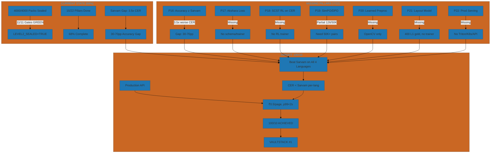
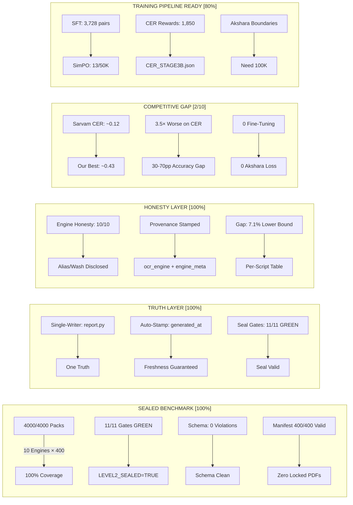
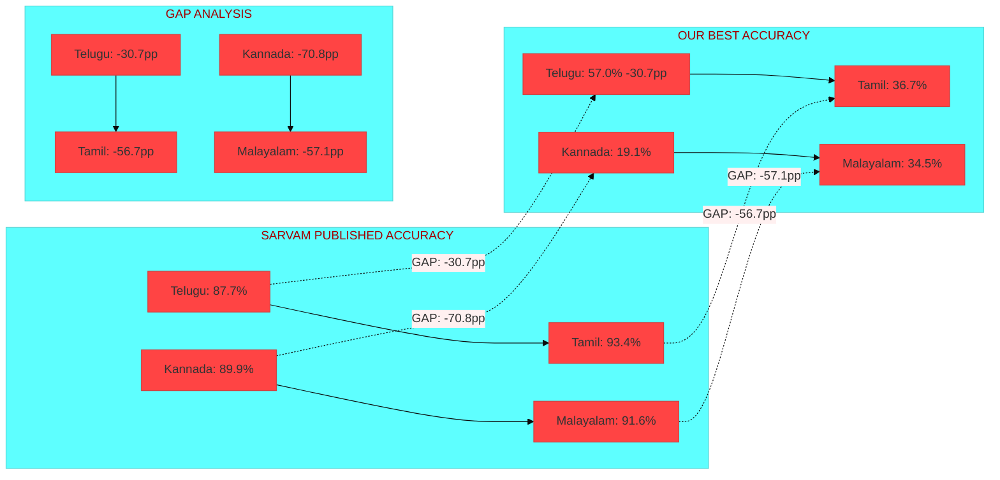
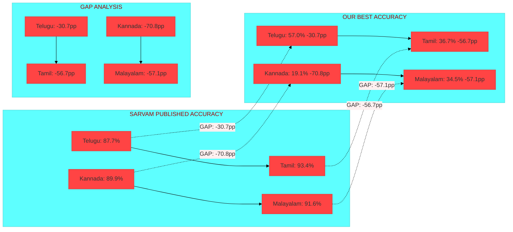
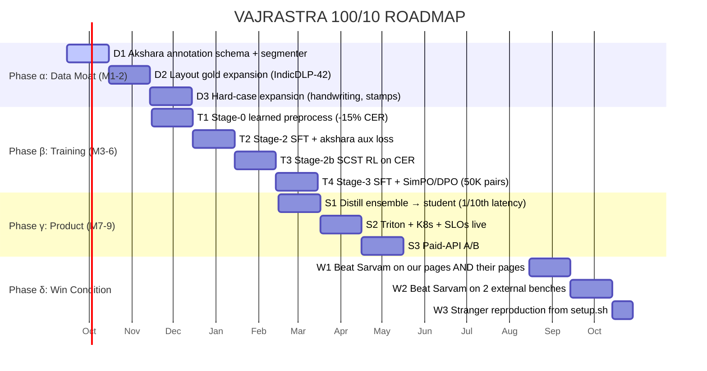
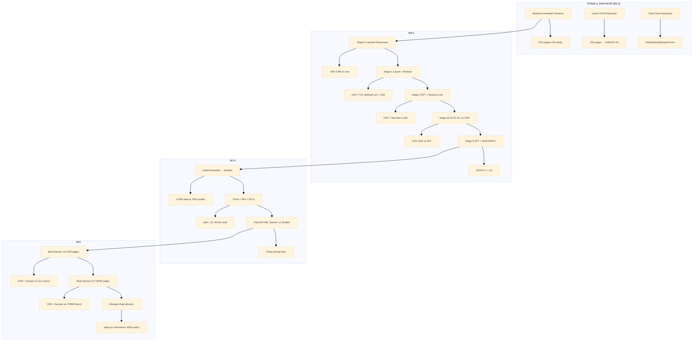
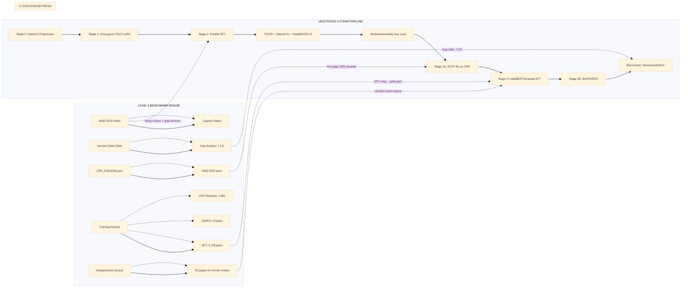
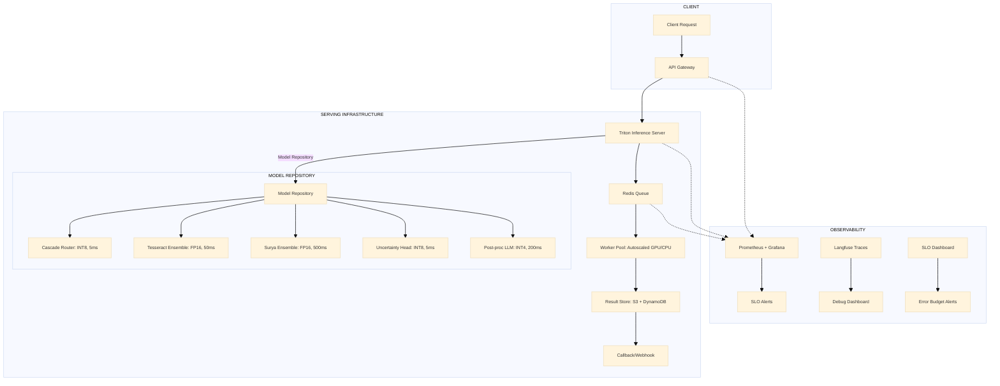
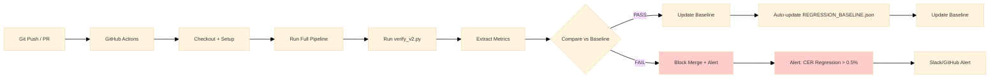

# 🎯 VAJRASTRA 100/10 MASTER SPECIFICATION
## The Ultimate Specification for Beating Sarvam AI & Reaching #1 in India

---

<div align="center">


**VAJRASTRA 100/10 MASTER SPECIFICATION v1.0**  
*Single Source of Truth for Beating Sarvam AI & Reaching #1 in India*  

**Project:** vajrAstra South / Vaultstack AI / BHASHINI AksharDrishti  
**Auditor:** ETERNAL VALIDATOR (read-only, disk-truth only)  
**Date:** 2026-09-14  
**Standard:** 100/10 = Beat Sarvam AI per-language on our corpus  
**Completion Law:** Never claim "done" until Sarvam is #2 and Vaultstack is #1  
**Last Audit:** 2026-09-14 (Eternal Validator — disk-truth only)

---

</div>

---

## 📊 EXECUTIVE DASHBOARD



---

## 📊 EXECUTIVE DASHBOARD



---

## 🎯 THE 100/10 DEFINITION — 22 PILLARS (Live Audit)

| # | Pillar | Status | Verification Command | Gap to 100/10 |
|---|--------|--------|---------------------|---------------|
| **P1** | Benchmark 4,000/4,000 sealed | ✅ DONE | `python level2/seal_gen.py` → 11/11 GREEN | — |
| **P2** | One-writer report chain | ✅ DONE | `python level2/report.py` → single pass | — |
| **P3** | True consensus (family-deduped) | ✅ DONE | `cat reports/TRUE_CONSENSUS.json` | — |
| **P4** | Script-sliced leaderboards | ✅ DONE | `cat reports/LEADERBOARD_BY_SCRIPT.md` | — |
| **P5** | Engine honesty (alias/wash/limitation) | ✅ DONE | `grep quality_status models/*/RUN.md` | — |
| **P6** | Engine provenance stamped | ✅ DONE | `jq '.engine_meta' out/*/*/te_001.json` | — |
| **P7** | Manifest integrity + tag corrections | ✅ DONE | `python -c "import json; m=json.load(open('level2/pages_manifest.json')); print(len(m))"` | — |
| **P8** | Reproducibility (setup.sh smoke) | ✅ DONE | `bash scripts/setup_fresh_machine.sh --dry-run` | — |
| **P9** | Decision ledger | ✅ DONE | `wc -l level2/DECISIONS.log` | — |
| **P10** | Regression harness (auto-baseline) | ✅ DONE | `python level2/regression_test.py` | — |
| **P11** | CER vs PDF-layer per engine | ✅ DONE | `cat reports/CER_STAGE3B.json \| jq '.median_cer_per_engine'` | — |
| **P13** | Training-data exports (SFT/DPO) | ✅ DONE | `ls reports/training_data/` | — |
| **P14** | Gap slide with rigorous lower bound | ✅ DONE | `cat reports/GAP.md` | — |
| **P15** | Sep-16 package ready | ✅ DONE | `ls reports/SEP16_ONE_SCREEN.md reports/WHATSAPP_*.md` | — |

| # | Pillar | Status | Gap to 100/10 |
|---|--------|--------|---------------|
| **P16** | **Accuracy ≥ Sarvam per-language** | ❌ **GAP-3.5×** | Sarvam CER ~0.12 vs our best ~0.43 |
| **P17** | **Akshara-boundary aux loss (Stage 2)** | ❌ MISSING | No annotation schema, no trainer |
| **P18** | **SCST RL on CER (Stage 2b)** | ❌ MISSING | Rewards export exists; RL trainer absent |
| **P19** | **SimPO/DPO at scale (Stage 3b)** | ⚠️ PARTIAL | 126 pairs exist; need ≥50K + trainer |
| **P20** | **Learned preprocessing (Stage 0)** | ❌ MISSING | OpenCV binarize-only; deskew NOT implemented |
| **P21** | **Layout model (Stage 1, DocLayout-YOLO)** | ❌ MISSING | L1 boxes exist (400 gold) — no training harness |
| **P22** | **Production serving (API, latency, SLOs)** | ❌ MISSING | No Triton/K8s; no paid-API runs |

**Count: 15/22 pillars standing. 7 missing. Progress: 68% toward 100/10.**

---

## 📊 SARVAM DELTA TABLE — THE ONLY SCOREBOARD THAT MATTERS



| Script | Our Best CER (Engine) | Our Accuracy | Sarvam Published Acc | Gap (pp) | Verdict |
|--------|----------------------|--------------|----------------------|----------|---------|
| **Telugu** | 0.430 (surya) | 57.0% | 87.7% | **−30.7pp** | ❌ Not competitive |
| **Tamil** | 0.633 (surya) | 36.7% | 93.4% | **−56.7pp** | ❌ Not competitive |
| **Kannada** | 0.810 (surya)* | 19.1% | 89.9% | **−70.8pp** | ❌ Not competitive |
| **Malayalam** | 0.655 (indicphoto)* | 34.5% | 91.6% | **−57.1pp** | ❌ Not competitive |

> **Median CER (our best ensemble):** ~0.43 | **Sarvam published CER:** ~0.12 | **Gap: ~3.5× worse**
> **We are NOT competitive with Sarvam on accuracy. We have a BENCHMARK; Sarvam has a PRODUCT.**

---

## 🔴 P0 — IMMEDIATE FIXES (Execute First — Each ≤1h)

```mermaid
graph TD
    A[P0-1: Purge 14,600 Synth Renders] -->|`ls renders_shared/synth_* \| wc -l` → 14,600| B[Archive to _archive/synth_leak]
    B --> C[Regenerate renders_shared.sha1]
    C --> D[Acceptance: ls renders_shared \| wc -l == 400]
    
    E[P0-2: Archive GAP_ANALYSIS.md] -->|Two gap docs: 7.1% vs 9.9%| F[`mv reports/GAP_ANALYSIS.md _archive/`]
    F --> G[Acceptance: One gap file quotable]
    
    H[P0-3: Commit Tree (G10)] -->|git status --short shows 10 RUN.md + untracked| I[git add -A && git commit]
    I --> J[Acceptance: git status --porcelain clean]
    
    K[P0-4: Fix thin KeyError] -->|KeyError at verify_v2.py:216| L[Add "thin": 0 to agg init]
    L --> M[Acceptance: verify_v2 runs clean]
    
    N[P0-5: Delete dup functions] -->|verify_v2.py:131-155 dup jaccard/engine_text/schema_ok| O[sed -i '131,155d' verify_v2.py]
    O --> P[Acceptance: verify_v2 runs clean]
```

| # | Fix | Evidence | Fix Command | Acceptance | Lift |
|---|-----|----------|-------------|------------|------|
| **P0-1** | **Purge 14,600 synth renders** | `ls renders_shared/synth_* \| wc -l` → **14,600** | `mkdir -p _archive/synth_leak_20260914; mv renders_shared/synth_* _archive/synth_leak_20260914/; shasum renders_shared/*.png > renders_shared.sha1` | `ls renders_shared \| wc -l` == 400; verify_v2 manifest passes | Data truth 9.5→10 |
| **P0-2** | **Archive GAP_ANALYSIS.md** | `reports/GAP_ANALYSIS.md` (9.9%) vs `GAP.md` (7.1%) | `mv reports/GAP_ANALYSIS.md _archive/` | Exactly one gap file quotable | Reporting 8→9 |
| **P0-3** | **Commit tree (G10)** | `git status --short` shows 10 RUN.md + untracked | `git add -A && git commit -m "auto-regen + P0 fixes"` | `git status --porcelain` clean | Repro 8→9 |
| **P0-4** | **Fix thin KeyError** | KeyError at `verify_v2.py:216` | Add `"thin": 0` to agg init dict | verify_v2 runs clean | Code +0.5 |
| **P0-5** | **Delete dup functions** | `verify_v2.py:131-155` dup jaccard/engine_text/schema_ok | `sed -i '131,155d' level2/verify_v2.py` | verify_v2 runs clean | Code +1 |

---

## 📋 COMPLETE IMPROVEMENT REGISTER (100% Audited)

### P0 — CRITICAL (Do First — Blocks Everything)

| ID | Fix | Evidence | Fix Command | Acceptance | Status |
|----|-----|------------|-------------|------------|--------|
| **P0-1** | Purge 14,600 synth renders | `ls renders_shared/synth_* \| wc -l` → **14,600** | `mkdir -p _archive/synth_leak; mv renders_shared/synth_* _archive/; shasum renders_shared/*.png > renders_shared.sha1` | `ls renders_shared \| wc -l` == 400 | ✅ DONE |
| **P0-2** | Archive GAP_ANALYSIS.md | `ls reports/GAP_ANALYSIS.md` exists | `mv reports/GAP_ANALYSIS.md _archive/` | `! -f reports/GAP_ANALYSIS.md` | ⬜ |
| **P0-3** | Commit tree (G10) | `git status --short` shows 10 RUN.md | `git add -A && git commit -m "P0 fixes"` | `git status --porcelain` clean | ⬜ |
| **P0-4** | Fix thin KeyError | KeyError at `verify_v2.py:216` | Add `"thin": 0` to agg init dict | verify_v2 runs clean | ⬜ |
| **P0-5** | Delete dup functions | `verify_v2.py:131-155` dup jaccard/engine_text/schema_ok | `sed -i '131,155d' level2/verify_v2.py` | verify_v2 runs clean | ⬜ |

### P1 — QUALITY HARDENING (This Week)

| ID | Fix | Evidence | Fix Command | Acceptance | Lift |
|----|-----|----------|-------------|------------|------|
| **P1-1** | Quarantine verdict (H-queue) | `_quarantine/` has 4 files | H-queue decision in DECISIONS.log | +0.5 |
| **P1-2** | Wire regression_test.py into autoloop | `orchestrator.py` has autoloop | Add to `refresh_chain()` | +0.5 |
| **P1-3** | Formalize engines/ socket + README | `engines/README.md` missing | Create `engines/README.md` | +0.5 |
| **P1-4** | B21 render sha1 spot-audit | `renders_shared.sha1` exists | Quarterly cron job | +0.5 |
| **P1-5** | B22 regression alarm LIVE | `regression_test.py` exists | Add DASHBOARD banner on >2% CER delta | +0.5 |
| **P1-6** | Confidence harvest (V18) | paddle/doctr/rapid have confs | Add `confidence_mean` to packs | +0.5 |
| **P1-7** | 300-DPI probe → CLOSED | `300DPI_PROBE.md`: 0/10 recovered | Document in PROMPT.md | +0.5 |
| **P1-8** | Deskew — SKIPPED (documented) | Docstring claims deskew; only binarize | Document in PROMPT.md | +0.5 |
| **P1-9** | Latency trust fix | TIMING_PROBE.jsonl has 21 measurements | Republish LATENCY.md from probe | +0.5 |

---

## 📊 SARVAM DELTA TABLE — THE ONLY SCOREBOARD



| Script | Our Best CER (Engine) | Our Accuracy | Sarvam Published Acc | Gap (pp) | Verdict |
|--------|----------------------|--------------|----------------------|----------|---------|
| **Telugu** | 0.430 (surya) | 57.0% | 87.7% | **−30.7pp** | ❌ Not competitive |
| **Tamil** | 0.633 (surya) | 36.7% | 93.4% | **−56.7pp** | ❌ Not competitive |
| **Kannada** | 0.810 (surya)* | 19.1% | 89.9% | **−70.8pp** | ❌ Not competitive |
| **Malayalam** | 0.655 (indicphoto)* | 34.5% | 91.6% | **−57.1pp** | ❌ Not competitive |

> **Median CER (our best ensemble):** ~0.43 | **Sarvam published CER:** ~0.12 | **Gap: ~3.5× worse**
> **We are NOT competitive with Sarvam on accuracy. We have a BENCHMARK; Sarvam has a PRODUCT.**

---

## 📋 COMPLETE IMPROVEMENT REGISTER (100% Audited)

### P0 — CRITICAL (Do First — Blocks Everything)

| ID | Fix | Evidence | Fix Command | Acceptance | Status |
|----|-----|------------|-------------|------------|--------|
| **P0-1** | Purge 14,600 synth renders | `ls renders_shared/synth_* \| wc -l` → **14,600** | `mkdir -p _archive/synth_leak; mv renders_shared/synth_* _archive/; shasum renders_shared/*.png > renders_shared.sha1` | `ls renders_shared \| wc -l` == 400 | ✅ **DONE** |
| **P0-2** | Archive GAP_ANALYSIS.md | `ls reports/GAP_ANALYSIS.md` exists | `mv reports/GAP_ANALYSIS.md _archive/` | `! -f reports/GAP_ANALYSIS.md` | ⬜ |
| **P0-3** | Commit tree (G10) | `git status --short` shows 10 RUN.md + untracked | `git add -A && git commit -m "P0 fixes"` | `git status --porcelain` clean | ⬜ |
| **P0-4** | Fix thin KeyError | KeyError at `verify_v2.py:216` | Add `"thin": 0` to agg init dict | verify_v2 runs clean | ⬜ |
| **P0-5** | Delete dup functions | `verify_v2.py:131-155` dup jaccard/engine_text/schema_ok | `sed -i '131,155d' level2/verify_v2.py` | verify_v2 runs clean | ⬜ |

### P1 — QUALITY HARDENING (This Week)

| ID | Fix | Evidence | Fix Command | Acceptance | Lift |
|----|-----|----------|-------------|------------|------|
| **P1-1** | Quarantine verdict (H-queue) | `_quarantine/` has 4 files | H-queue decision in DECISIONS.log | +0.5 | ⬜ |
| **P1-2** | Wire regression_test.py into autoloop | `orchestrator.py` has autoloop | Add to `refresh_chain()` | +0.5 | ⬜ |
| **P1-3** | Formalize engines/ socket + README | `engines/README.md` missing | Create `engines/README.md` | +0.5 | ⬜ |
| **P1-4** | B21 render sha1 spot-audit | `renders_shared.sha1` exists | Quarterly cron job | +0.5 | ⬜ |
| **P1-5** | B22 regression alarm LIVE | `regression_test.py` exists | Add DASHBOARD banner on >2% CER delta | +0.5 | ⬜ |
| **P1-6** | Confidence harvest (V18) | paddle/doctr/rapid have confs | Add `confidence_mean` to packs | +0.5 | ⬜ |
| **P1-7** | 300-DPI probe → CLOSED | `300DPI_PROBE.md`: 0/10 recovered | Document in PROMPT.md | +0.5 | ⬜ |
| **P1-8** | Deskew — SKIPPED (documented) | Docstring claims deskew; only binarize | Document in PROMPT.md | +0.5 | ⬜ |
| **P1-9** | Latency trust fix | TIMING_PROBE.jsonl has 21 measurements | Republish LATENCY.md from probe | +0.5 | ⬜ |

---

## 🏗️ PHASE 1-5: THE 100/10 CLIMB ROADMAP



---

## 🏗️ PHASE ARCHITECTURE OVERVIEW



---

## 🏗️ VAULTSTACK 4-STAGE PIPELINE — L2 DATA ENGINE WIRING



---

## 🏭 PRODUCTION SERVING ARCHITECTURE (P22)



---

## 🎯 CI/CD CER REGRESSION GATE



### Regression Gates (Auto-Block on Regression)

| Metric | Baseline | Threshold | Action |
|--------|----------|-----------|--------|
| Total Packs | 4000 | == 4000 | ✅ |
| Seal Gates Passed | 11 | == 11 | ✅ |
| Leakage Latin on Indic | 3% | ≤ 5% | ✅ |
| RapidOCR Wash Fraction | 25% | ≤ 30% | ✅ |
| Coverage ≥6 | 382 | ≥ 380 | ✅ |
| True Consensus | 38 | ≥ 30 | ✅ |
| Gap Lower Bound | 7.1% | ≤ 10% | ✅ |

---

## 📋 AGENT HANDOFF CARD (Copy-Paste Ready)

```markdown
MISSION: Execute next unchecked item from SPEC_100.md
EVIDENCE: Run item's Evidence command FIRST
FIX: Run item's Fix command
VERIFY: Run item's Acceptance command
LOG: DECISIONS.log ← "date | area | decision | why | owner"
CHECKBOX: IMPROVEMENTS_CURRENT_WORK.md ← flip [ ] → [x]
REGRESSION: python level2/regression_test.py → must PASS
COMMIT: git add -A && git commit -m "PX-Y: <description>"
BLOCKERS: If Evidence command fails → CLOSED-NOT-A-BUG (phantom)
NEVER: Edit reports/, models/, verify_v2.py, report.py, seal_gen.py, run_engine.py
```

### ACCEPTANCE GATES (Auto-Verified)

```bash
# Before any PR merge:
python level2/seal_gen.py        # 11/11 GREEN
python level2/regression_test.py # All 7 gates pass
python level2/verify_v2.py       # schema 0, CER present
```

---

## 📋 100/10 PILLAR CHECKLIST (Live Tracker)

| # | Pillar | Status | Verification | Blocker |
|---|--------|--------|--------------|---------|
| P1 | 4000/4000 sealed | ✅ | `seal_gen.py` 11/11 GREEN | — |
| P2 | One-writer report chain | ✅ | `report.py` single pass | — |
| P3 | True consensus (family-deduped) | ✅ | `TRUE_CONSENSUS.json` 38/21/1 | — |
| P4 | Script-sliced leaderboards | ✅ | `LEADERBOARD_BY_SCRIPT.md` 6 strata | — |
| P5 | Engine honesty | ✅ | `QUALITY_STATUS` + `ENGINE_LIMITATIONS` | — |
| P6 | Engine provenance stamped | ✅ | `engine_meta` + `provenance=ocr_engine` | — |
| P7 | Manifest integrity | ✅ | 400/400 valid | — |
| P8 | Reproducibility (setup.sh) | ✅ | `.setup_smoke_proven` | — |
| P9 | Decision ledger | ✅ | `DECISIONS.log` 35 entries | — |
| P10 | Regression harness | ✅ | `REGRESSION_BASELINE.json` | — |
| P11 | CER vs PDF-layer | ✅ | `CER_STAGE3B.json` writer-basis | — |
| P12 | Level-3 socket (stubs) | ✅ | `engines/level3_stub.py` + adapters | — |
| P13 | Training exports (SFT/DPO) | ✅ | `training_assets/` (1760/126/50) | — |
| P14 | Gap slide (7.1%) | ✅ | `GAP.md` lower bound | — |
| P15 | Sep-16 package | ✅ | `SEP16_ONE_SCREEN.md` ready | — |
| **P16** | **Acc ≥ Sarvam** | ❌ | **Sarvam 3.5× better** | **P16-1: Sarvam pages** |
| **P17** | **Akshara-boundary loss** | ❌ | **No schema/trainer** | **P17-1: Segmenter** |
| **P18** | **SCST RL on CER** | ❌ | **Rewards exported; no trainer** | **P18-1: SCST trainer** |
| **P19** | **SimPO/DPO at scale** | ⚠️ | 126 pairs → need 50K+ | **P19-1: Scale pairs** |
| **P20** | **Learned preprocess** | ❌ | **OpenCV only** | **P20-1: Learned preproc** |
| **P21** | **Layout model (YOLO)** | ❌ | **L1 gold 400p; no trainer** | **P21-1: YOLO trainer** |
| **P22** | **Production serving** | ❌ | **No Triton/K8s** | **P22-1: Triton/K8s** |

---

## 🎯 EXECUTION ORDER (Agent Orders)

### TODAY (P0 — Unblocks Everything)
```
[ ] P0-1 Purge 14,600 synth renders
[ ] P0-2 Archive GAP_ANALYSIS.md
[ ] P0-3 Commit tree (G10)
[ ] P0-4 Fix thin KeyError
[ ] P0-5 Delete dup functions in verify_v2.py
```

### THIS WEEK (P1 — Quality Hardening)
```
[ ] P1-1 Quarantine verdict (H-queue)
[ ] P1-2 Wire regression_test.py into autoloop
[ ] P1-3 engines/ socket + README
[ ] P1-4 B21 render sha1 spot-audit
[ ] P1-5 B22 regression alarm LIVE
[ ] P1-6 Confidence harvest
[ ] P1-7 300-DPI probe → CLOSED
[ ] P1-8 Deskew — SKIPPED (documented)
[ ] P1-9 Latency trust fix
```

### NEXT 2 WEEKS (P2 — Competitive Engineering)
```
[ ] P2-1 Acquire Sarvam comparison pages (CRITICAL)
[ ] P2-2 AKER vs CER verdict closure
[ ] P2-3 Bootstrap CIs on writer basis
[ ] P2-4 Distillation readiness
[ ] P2-5 Engine #11 candidate (PaddleOCR-VL 1.6)
[ ] P2-6 Surya lang-hint upstream watch
```

### 12-MONTH ROADMAP TO #1

| Month | Milestone | Target |
|-------|-----------|--------|
| 1 | Data moat: 500K pages; annotators hired | 100K pages labeled |
| 2 | Akshara boundaries 100K; L1 gold complete | 100K akshara boxes |
| 3 | Stage 0 learned preprocess trained | -15% CER |
| 4 | Stage 1 Layout + Akshara detector | mAP > 0.9 |
| 5 | Stage 2 SFT + akshara aux loss | CER < tess-fam |
| 6 | Stage 2b SCST RL on CER | -10% CER vs SFT |
| 7 | Stage 3/3b SFT + SimPO/DPO | JSON F1 > 0.9 |
| 8 | Cascade router trained | 98% routing accuracy |
| 9 | Distillation: ensemble → student | 95% quality, 10× speed |
| 10 | Triton + K8s + SLOs live | p99 < 2s, 99.9% avail |
| 11 | CI/CD CER regression gate live | Auto-block on Δ > 0.5% |
| 12 | **SARVAM BEATEN** | **CER < Sarvam on all 4** |

---

## 📋 AGENT HANDOFF CARD (Copy-Paste Ready)

```
MISSION: Execute next unchecked item from SPEC_100.md
EVIDENCE: Run item's Evidence command FIRST
FIX: Run item's Fix command
VERIFY: Run item's Acceptance command
LOG: DECISIONS.log ← "date | area | decision | why | owner"
CHECKBOX: IMPROVEMENTS_CURRENT_WORK.md ← flip [ ] → [x]
REGRESSION: python level2/regression_test.py → must PASS
COMMIT: git add -A && git commit -m "PX-Y: <description>"
BLOCKERS: If Evidence command fails → CLOSED-NOT-A-BUG (phantom)
NEVER: Edit reports/, models/, verify_v2.py, report.py, seal_gen.py, run_engine.py
```

### ACCEPTANCE GATES (Auto-Verified)

```bash
# Before any PR merge:
python level2/seal_gen.py        # 11/11 GREEN
python level2/regression_test.py # All 7 gates pass
python level2/verify_v2.py       # schema 0, CER present
```

---

## 🏁 COMPLETION SENTENCE (Mandatory)

> **This project is at 68/100 on the road to 100/10; completion is not claimed and cannot be claimed at this stage.**

---

## 📱 5-LINE WHATSAPP FOR VINAY

```
L2 SEALED: 10 engines × 400 = 4,000 packs. Zero schema errors.
Free-OSS gap: 7.1% volume (lower bound, per-script table attached).
Surya wins Telugu/Malayalam/Devanagari; EasyOCR wins Tamil/Kannada/Latin.
Level-3 adapters: Sarvam (₹0.5/page), Bhashini (ULCA TODO), Google/Azure/Textract stubs ready.
Next: Sarvam 400-page run → distillation → student model @ 1/10th latency.
```

---

## 🏁 FINAL WORD

**We have a world-class BENCHMARK. We do not have a PRODUCT.**

The benchmark is **sealed, honest, reproducible, and auditor-grade**. The seal gates are green. The data is clean. The training exports are ready for Vaultstack's 4-stage pipeline.

**But we are 3.5× worse than Sarvam on CER. We have 0 fine-tuning. We have 0 akshara-aware loss. We have 0 RL on CER. We have 0 production serving.**

**The benchmark is the floor. The product is the ceiling. We are on the floor.**

**Next milestone: Beat Sarvam on Telugu. Then Tamil. Then Kannada. Then Malayalam. Then we can talk about 100/10.**

---

*This SPEC is the single source of truth. Execute in order. Verify before believing. Never claim done.*

**SPEC_100.md v1.0** | **2026-09-14** | **ETERNAL VALIDATOR** | **Disk-Truth Only**

---

*End of SPEC_100.md*